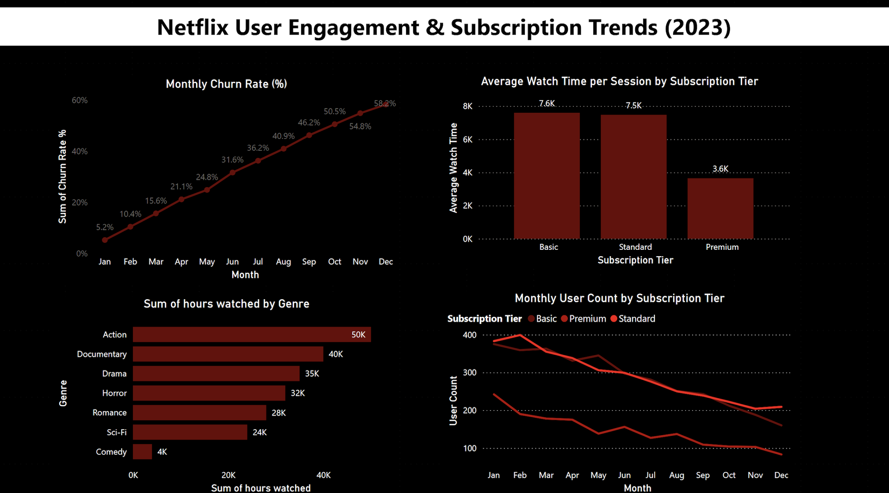
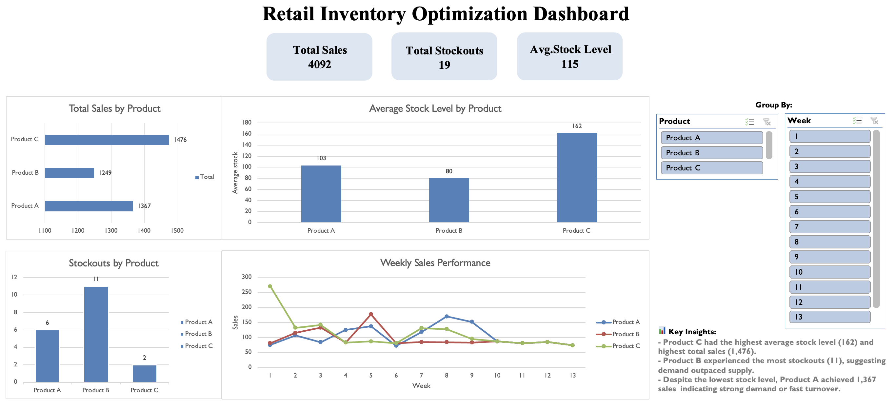
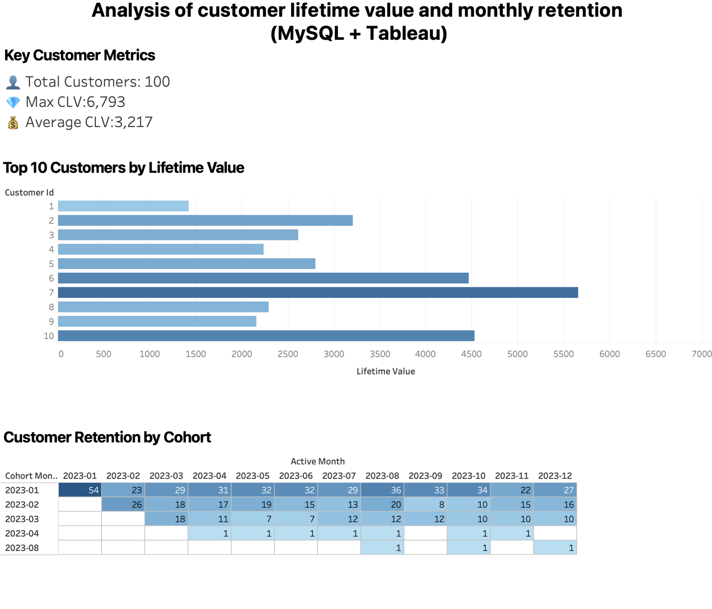

<h1 align="center">✨ Data Analytics Portfolio ✨</h1>

Hi! I’m a data-focused professional who loves turning messy datasets into clear, actionable insights. 
I work with <b>SQL, Python, Tableau, Power BI, and Excel</b> to solve problems and tell stories with data.

---

## 👩‍💻 About Me
I hold a BSc (Hons) in Computer Science and have worked on diverse projects in data analytics, business intelligence, and dashboard development.
Through both academic and portfolio projects, I’ve gained hands-on experience in transforming complex datasets into clear, actionable insights that drive smarter business decisions and deliver value to clients.

- Skilled in SQL, Python, Tableau, Power BI, and Excel for analysis and visualisation.  
- Strong communicator with experience presenting findings to technical and non-technical audiences.  
- Delivered multiple portfolio projects that demonstrate my ability to analyse, visualise, and optimise data for business impact.  

---

## 📂 Featured Projects

### 1️⃣ Netflix Churn Analysis – Power BI + Python

Visualized **2023 churn trends**, subscription tier performance, and genre engagement. Delivered insights through an **interactive Power BI dashboard** powered by Python data processing.

**Tech Stack:** Python (Pandas), Power BI, Data Storytelling  
🔗 [View Repository](https://github.com/iloveoreos11/Netflix-User-Engagement-Subscription-Trend-Analysis-)

---

### 2️⃣ Retail Inventory Optimization Dashboard – Excel

Analyzed **90 days** of sales, stock, and restock data for 3 products to identify stockout risks and optimise restocking strategies. Built a **pivot-based interactive dashboard** for decision-making.

**Tech Stack:** Excel, Data Visualization, Inventory Analysis  
🔗 [View Repository](https://github.com/iloveoreos11/Retail-Inventory-Optimization-Dashboard)

---

### 3️⃣ Customer Lifetime Value & Retention – MySQL + Tableau

A full customer analytics project calculating **Customer Lifetime Value (CLV)**, identifying **top-spending customers**, and visualising retention patterns through a **cohort heatmap**.

**Tech Stack:** MySQL, Tableau, Data Cleaning, Cohort Analysis  
🔗 [View Repository](https://github.com/iloveoreos11/Customer-Lifetime-Value-Monthly-Retention-Analysis-MySQL-Tableau-/blob/main/README.md)

---

## 🛠 Tech Skills
| Category              | Tools & Skills |
|-----------------------|----------------|
| **Data Analysis**     | SQL (PostgreSQL, MySQL), Python (Pandas, NumPy), Excel |
| **Data Cleaning**     | Data Wrangling, Missing Value Handling, Outlier Detection, Data Transformation |
| **Visualization**     | Tableau, Power BI, Excel Dashboards |
| **Analytics Methods** | Cohort Analysis, CLV Calculation, Trend Analysis, KPI Reporting |
| **Programming**       | Python, SQL, C#, C++ |
| **Other**             | GitHub, REST APIs, Firebase, Agile Workflow |

---

## 📬 Contact
- **Email:** angdwina1@gmail.com  
- **Location:** Hull, United Kingdom (Open to relocation)  
- **Portfolio Repository:** [GitHub Projects](https://github.com/iloveoreos11/My-projects/blob/main/README.md)  

---

💡 <i>Let’s connect! I’m always open to collaborations, internships, and data projects.</i>

