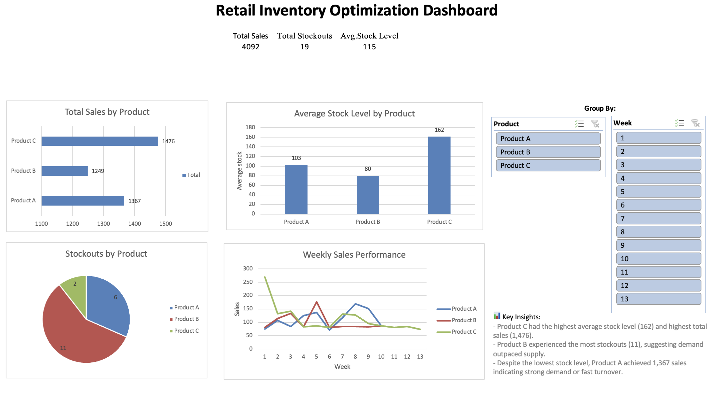
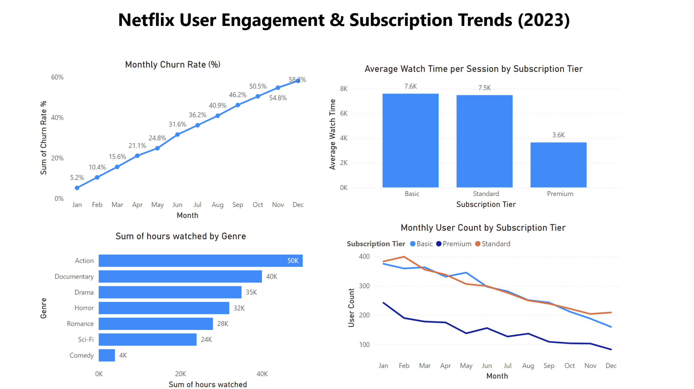

<h1 align="center">✨  Data Analytics Portfolio ✨</h1>

---

## 👋 About Me
Hi! I’m a data-focused Computer Science graduate who loves turning messy datasets into clear, actionable insights.  
I work with **SQL, Python, Tableau, Power BI, and Excel** to solve  problems and tell stories with data.

---

## 📂 Featured Projects

### 1️⃣ Customer Lifetime Value & Retention – MySQL + Tableau

**What I Did:**
- Calculated **Customer Lifetime Value (CLV)**
- Identified **top-spending customers**
- Built a **cohort retention heatmap**  
**Tech Stack:** MySQL, Tableau, Data Cleaning, Cohort Analysis  
🔗 [View Repository](https://github.com/iloveoreos11/Customer-Lifetime-Value-Monthly-Retention-Analysis-MySQL-Tableau-/blob/main/README.md)

---

### 2️⃣ Retail Inventory Optimization Dashboard – Excel

**What I Did:**
- Analyzed daily **sales, stock, and restocks** for 3 products over 90 days  
- Built an **interactive Excel dashboard** with PivotTables  
**Tech Stack:** Excel, Data Visualization, Inventory Analysis  
🔗 [View Repository](https://github.com/iloveoreos11/Retail-Inventory-Optimization-Dashboard)

---

### 3️⃣ Netflix Churn Analysis – Power BI + Python

**What I Did:**
- Visualized **2023 churn trends, subscription tier performance, and genre engagement**
- Delivered insights via an **interactive Power BI dashboard**  
**Tech Stack:** Python (Pandas), Power BI, Data Storytelling  
🔗 [View Repository](https://github.com/iloveoreos11/Netflix-User-Engagement-Subscription-Trend-Analysis-)

---

## 🛠 Tech Skills
| Category              | Tools & Skills |
|-----------------------|----------------|
| **Data Analysis**     | SQL (PostgreSQL, MySQL), Python (Pandas, NumPy), Excel |
| **Visualization**     | Tableau, Power BI, Excel Dashboards |
| **Programming**       | Python, SQL, C#, C++ |
| **Other**             | GitHub, REST APIs, Firebase, Agile Workflow |

---

  💡 <i>Let’s connect! I’m always open to collaborations, internships, and data projects.</i>  

